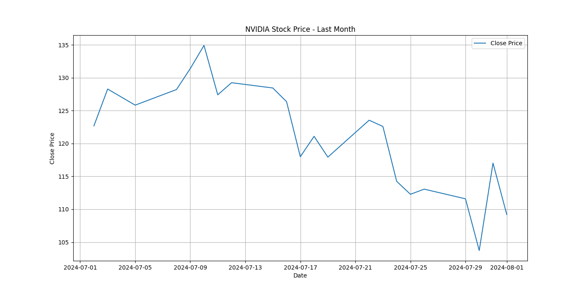

# NVIDIA股票过去一个月表现分析

## 概述
在过去的一个月里，NVIDIA（NVDA）的股票价格经历了显著的波动。从2024年7月2日到2024年8月02日，股票的收盘价从$103.73上涨到$134.91，整体变化率为30.06%。

## 详细分析
- **开盘价**: 平均开盘价为$122.535，最高开盘价为$135.75，最低开盘价为$111.52。
- **收盘价**: 平均收盘价为$121.2268，最高收盘价为$134.91，最低收盘价为$103.73。
- **最高价**: 平均最高价为$124.6768，最高价为$136.15，最低最高价为$111.99。
- **最低价**: 平均最低价为$118.9850，最高最低价为$132.42，最低最低价为$102.54。
- **交易量**: 平均交易量为302,075,900股，最高交易量为523,462,300股，最低交易量为173,911,000股。

## 走势图

## 结论
总体来看，NVIDIA在过去一个月的股票表现显示出上涨的趋势，这可能受到市场因素、公司新闻或行业动态的影响。投资者应密切关注这些因素，以做出明智的投资决策。